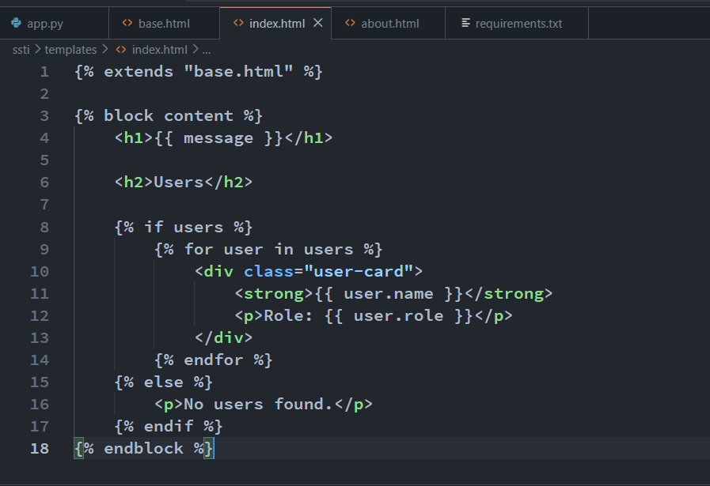

# SSTI(Server-side Template Injection)

## Template là gì:

Template được dùng để tạo dynamic content trong web app, ví dụ như chỉ cần tạo template index.html với template engine jinja2 kiểu như sau:

Rồi ở endpoint / chỉ cần pass tham số vào template mà mình mong muốn:

Thì nó sẽ tự động tạo ra html với các tham số mình pass vào:

Ngoài dùng để hiện thị các tham số, nó còn nhiều tính năng như if/else, for loop, auto-escape, kế thừa template khác,…. 

## Root cause SSTI

Có thể thấy là khi ta pass tham số vào template thì template có thể truy cập tới các biến tham số này, chứng tỏ là nó cũng có thể truy cập không chỉ những biến này mà còn những biến global khác  mà nội dung của biến đó có thể lộ thông tin nhạy cảm hoặc ta có thể dùng các biến global đó truy cập tới những module có mục đích đọc file, RCE,….

Lỗ hổng SSTI xảy ra khi ta có thể kiểm soát được template  hoặc 1 phần template mà template engine như jinja2 render, khi đó ta có thể dùng syntax của template engine để truy cập những biến global nhạy cảm và những module nhạy cảm để đọc file, RCE,…

Ví dụ ở đoạn code vulnerable sau:

Code dùng jinja2 template engine để render template trực tiếp từ tham số c của người dùng truyền vào, từ đó người dùng có thể truyền vào template có nội dung độc hại. Ở đây với payload thông thường 7*7, template engine tính toán và đưa ra kết quả 49

Debug để biết được đằng sau nó hoạt động ra sao:

Khi gọi render_template_string thì nó sẽ gọi `template = app.jinja_env.from_string(source)` với source là {{7*7}} 

Rồi ở hàm from_string nó sẽ `compile(source)`

Ở hàm compile thì đầu tiên source sẽ được parse thành AST có giá trị `Template(body=[Output(nodes=[Mul(left=Const(value=7), right=Const(value=7))])])` rồi sẽ thực hiện generate ra code python để thực thi

Kết quả của bước generate sẽ là 1 class như sau:

Cùng xem hàm generate làm những gì:

Đầu tiên là tạo instance từ class CodeGenerator rồi visit node với node là AST mới parse vừa nãy:

Ở hàm visnếu node là Template thì ở hàm get_visitor sẽ trả về hàm visit_Template rồi thực thi hàm đó. Tương tự với các node khác.

Ở hàm visit_Template thì nó sẽ generate ra đoạn code ở đoạn màu xanh

Còn ở đoạn này thì nó sẽ process root và generate ra đoạn code màu đỏ, đây là đoạn logic chính xử lý nội dung template của jinja2. 

Đầu tiên nếu là self thì nó sẽ output `self = TemplateReference(context)`, và nếu gặp biến ví dụ là `{{config}}` thì nó sẽ output `l_0_config = resolve("config")` do ở hàm `enter_frame()` như sau:

Và sau đó là hàm pull_dependencies dùng để kiếm tất cả các filter dùng đến trong template như upper, lower rồi gán vào biến ở đầu hàm root() để có thể sử dụng. Rồi cuối cùng là visit đệ quy các node còn lại `[Output(nodes=[Mul(left=Const(value=7), right=Const(value=7))]` ở hàm blockvisit()

Thử với payload RCE:

Tương tự như trên khi debug thì khi parse ra AST sẽ ra giá trị `Template(body=[Output(nodes=[Call(node=Getattr(node=Call(node=Getattr(node=Getitem(node=Getattr(node=Getattr(node=Getattr(node=Name(name='config', ctx='load'), attr='**class**', ctx='load'), attr='**init**', ctx='load'), attr='**globals**', ctx='load'), arg=Const(value='os'), ctx='load'), attr='popen', ctx='load'), args=[Const(value='whoami')], kwargs=[], dyn_args=None, dyn_kwargs=None), attr='read', ctx='load'), args=[], kwargs=[], dyn_args=None, dyn_kwargs=None)])])` , có thể thấy là từ biến config ban đầu nó dùng node `Getattr` và `Getitem` để truy cập tới các class và module liên quan rồi cuối cùng gọi hàm bằng node `Call`

Để hiểu tại sao lại truy cập theo thứ tự như vậy thì ta cần biết rằng mọi thứ trong python đều là object, và nó dùng OOP tức là mọi class đều bắt nguồn từ 1 class nào đó. Và object là một thực thể tạo ra từ 1 class. Ở đây ý tưởng là:

1. Truy cập biến mà ta có thể truy cập, để biết được biến global đặc biệt  nào ta có thể truy cập thì ta tạo endpoint sau:
    
    
    
    
    
    
    Ngoài ra ta cũng có thể truy cập các biến như [], “”, (), {}, self
    
2. Từ biến đó, truy cập đến class liên quan đến biến đó. Ví dụ:
    - Class của biến đó thông qua magic method `__class__`
    - Di chuyển sang các class khác thông qua các magic method như `__base__` ,`__bases__` ,`__mro__` , `__subclasses__`
        
        `__base__` : chỉ output ra class cha trực tiếp duy nhất
        
        `__bases__`output ra danh sách class cha
        
        `__subclasses__` output danh sách class con
        
        `__mro__` : output danh sách class theo thứ tự ưu tiên khi tìm và gọi hàm. Ví dụ như ta có đoạn code sau:
        
        
        
        Output của script trên sẽ là:
        
        
        
        đó là thứ tự khi có nhiều hàm process() thì class sẽ ưu tiên gọi hàm theo thứ tự trên
        
3. Tìm class nào chứa module nhạy cảm, ta truy cập module đó để thực hiện đọc file, RCE,…

Ở payload trên, nó truy cập biến config:

Xong rồi truy cập đến class của biến config:

Rồi khởi tạo lớp đó bằng constructor, kiểu trả về là 1 hàm:

Rồi từ hàm đó, ta dùng `__globals__` để lấy danh sách các module define có trong namespace của hàm đó:

Ở đây ta có thể truy cập module os và truy cập hàm popen để RCE:

Ngoài RCE, ta cũng có thể đọc file, biến môi trường

## Bypass

### Filter trong jinja2

Dùng filter có sẵn trong jinja template engine như `attr` để truy cập các property mà không sử dụng dấu `.` , trong string có thể dùng hex hoặc  để bypass filter các từ đặc biệt.

Hoặc dùng join như sau:

### Request kiểm soát được từ url

###  thay cho {{}}

### Format string

### Cộng chuỗi

### Bypass độ dài

- Dùng payload ngắn kiểu như sau hoặc dùng biến :
    
    <aside>
    💡
    
    {{url_for.__globals__.os.environ}}
    
    {{ joiner.__init__.__globals__.os.popen('id').read() }}
    
    {{request['application']['__globals__']['__builtins__'][['](https://www.notion.so/'os')__import__[']'popen']['read']}}
    
    </aside>
    
- Nếu ứng dụng bị lỗi SSTI ở nhiều field trong cùng 1 trang thì có thể tách payload ra các field, miễn sao khi nối lại thì payload vẫn hợp lệ

### Dùng các magic method trong python

List các magic method trong python có thể tìm ở đây: https://docs.python.org/3/reference/datamodel.html

### Blind injection

Nếu Waf quá khó mà không thể dùng payload để RCE trực tiếp được thì dùng payload để tạo ra blind true/false 

### Tool

Có thể dùng tool sau để bypass waf jinja2: https://github.com/Marven11/Fenjing

## Phát hiện

## Impact

### RCE: như đã đề cập bên trên

### XSS

Ngoài RCE ta cũng có thể XSS bằng cách dùng safe filter trong jinja2 để nó không escape output payload của chúng ta

### Leak secret_key trong  để giả mạo cookie

Trong trường hợp black list quá chặt không thể RCE được thì còn một attakc vector có thể leak secret key để giả mạo cookie và nâng quyền lên cao hơn

## Prevent

Không cho người dùng kiểm soát template được render, chỉ cho người dùng truyền tham số vào template. Ví dụ trong python flask:

## Java( FreeMarker)

Ở đây ta sẽ debug lỗi SSTI trong template engine Freemarket trong Java. Và cũng giống như root cause đã trình bày bên trên, ở đây có endpoint render lấy tham số template từ người dùng nhập vào để xử lí rồi trả kết quả, dẫn đến bị SSTI

Tuy nhiên để bị lỗi SSTI này thì trong config của FreeMarker lúc tạo phải:

- Để class resolver là unrestricted, khi đó thì có thể dùng cú pháp `new` trong template để tạo class bất kỳ
- Hoặc bật tính năng API để có thể truy cập một số API có sẵn trong template, nhằm gọi một số hàm đặc biệt

Ở đây để đơn giản ta sẽ debug payload này `<#assign ex = "freemarker.template.utility.Execute"?new()>${ ex("id")}` 

Payload trên đầu tiên sẽ dùng cú pháp `?new()` để tạo class `freemarker.template.utility.Execute`, một class có hàm `exec` dùng để thực thi câu lệnh

Sau đó dùng cú pháp assign để gán giá trị của object vừa tạo vô biến `ex`  

Rồi cuối cùng thực hiện method call, gọi hàm exec của class `freemarker.template.utility.Execute`

Cụ thể hơn, ở bước đầu tiên, khi tạo template, thì nó cũng sẽ có quy trình khá giống jinja2, đầu tiên nó sẽ parse ra AST tree:

Sau đó tạo môi trường `Environment` rồi visit AST rồi xử lý node trong AST

Với mỗi node nó sẽ gọi hàm accept của node đó:

assign sẽ gọi hàm accept của Assignment node và gán giá trị

Còn cú pháp  `?new` thì nó sẽ dùng class NewBI

Còn đây là lúc nó resolve class Execute, do trong config của freemarker ta để unrestricted rồi nên nó có thể resolve được class Execute

Sau khi resolve xong sẽ tạo newInstance:

Và cuối cùng thực hiện method call giống như đã nói bên trên bằng cách gọi hàm exec của class `freemarker.template.utility.Execute` 

## PHP(Twig)

Vulnerable code:

Ta sẽ debug payload này `{{['id']|filter('system')}}` , mục đích bình thường của payload trên là chỉ tạo một array rồi dùng hàm array_filter để lọc ra những phần tử cần thiết rồi output ra ngoài 

Tuy nhiên hàm array_filter trong php lại có thể nhận hàm callback bất kỳ và cũng như twig không ngăn chặn nên từ đó ta có thể SSTI, gọi hàm `system` với tham số id

Đầu tiên là bước tạo template, nó gọi hàm createTemplate trong Environment, lưu template vào loader, và gọi loadTemplate

Trong hàm loadTemplate sẽ compileSource(), khi đó nó sẽ tokenize các ký tự trong template, parse template ra rồi compile.

Khi đó biến content sẽ là file php sẵn sàng để thực thi:

Và rồi eval content

File content có dạng như sau: hàm chính sẽ là hàm doDisplay

Hàm doDisplay sẽ được gọi khi ta gọi template→render(), tiếp theo nó sẽ gọi display(), rồi yield(), trong yield sẽ gọi doDisplay()

Và như ở trên trong doDisplay của class php mà twig vừa tạo sẽ gọi tới CoreExtension→filter()

Hàm sink sẽ là array_filter với array là array [”id”] còn callback function là hàm system()

Tuy nhiên ở hàm self::checkArrow(), do ta không trong sandbox mode nên nó không check hàm callback function phải là Closure(Closure ví dụ như là arrow function như ví dụ ở dưới)

Từ đó nó gọi `array_filter([”id”], system)` và thực thi câu lệnh `system(”id”)`